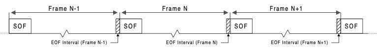

### Layer 3: Frames

This is a very brief summary of Section 10.2.3, "Frame generation", together with bits of Chapter 4, "Data Flow Model", and Chapter 11, "Hub specification" of the USB 1.1 specification. For more detail please refer to those chapters.

#### Overview´

Total bus time is divided in **frames**, each with a 1 ms duration. The purpose of frames is to:

* provide all devices with a shared sense of time
* manage bus bandwith

As an example of the first, devices can request to be polled at regular intervals; such intervals are expressed in terms of (multiples of) milli-seconds.

An example of the second is that no more than 90% of total frame time can be allocated to isosynchrous requests (scheduled datagrams).

The start of each frame is the transmission of a special token packet, the SOF packet.

#### Keep-alive

SOF packets are specific to a full-speed bus segment. In order to conserve bus bandwith, on a low-speed bus segment the SOF packet is replaced by a ***Keep-Alive*** signal.

A keep-alive signal is two LS bit-times of `SEO`, followed by one bit-time of `J`. The same said another way is that on a LS bus segment, the host (or hub) sends a free-standing EOP once per milli-second.

#### Host responsibilities

Frames are created by the Host Controller through issuing Start-of-Frame (SOF) tokens at 1 ms intervals:

The SOF token is the first transmission in the frame period. After issuing a SOF token, the Host Controller is free to transmit other transactions for the remainder of the frame period. When the Host Controller is in its normal operating state, SOF tokens must be continuously generated at the 1ms periodic rate, regardless of the other bus activity or lack thereof.

The SOF token holds the highest priority access to the bus, and the host (and hubs) must make sure that neither it or any device is using the bus when the next SOF token is due (the "EOF interval")

It is the responsibility of the host to not provoke a response from a device if the response would cause the device to be sending a packet inside the EOF interval. The host is allowed to use a conservative algorithm for deciding whether or not to start a transaction.
 
#### Hub responsibilities

Hubs must maintain their own frame timer, which is locked to the Host frame timer. This allows Hubs to time the interval and predict that a SOF packet is about to be sent. The internal timer must lock within two frame times.

To compensate for time skew, the EOF interval is set at 40 bit-times before the predicted transmission of the next SOF packet. If a device is still transmitting on the bus when the exclusion interval starts (it is "babbling"), the Hub shuts down the repeater and inserts a (full-speed !) EOP itself in order to free the bus.

The Hub port of the offending device is disabled and must be explicitely re-enabled / reset by the Host.

#### Device responisibilities

Devices other than Hubs have no special frame obligations.
