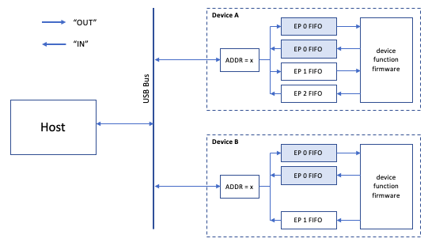

### USB Architecture

#### Introduction

As the name Universal Serial Bus implies, USB uses a bus architecture, i.e. all devices connected to a single USB root share the same signals and only one device can use the bus at any one time. There is only one bus master, called the "Host". It operates the root port to which other devices are attached.

It is however designed as tiered, segmented bus: the devices are not all daisy chained together, but instead connected via hubs. Every bus segment ("USB cable") is managed individually for power and speed. The specification puts the maximum number of tiers at 6, in order to put a cap on timing delays in the system.

Note that it is possible to connect a device directly to the root port and use just a single tier.

Data transfers from the host to a device are refered to as "outbound" or "downstream" and from the device to the host as "inbound" or "upstream".

#### Speeds

A bus segment can operate at different speeds, the number of options increased over time:

| Name | Origin | Speed | Typical use |
|:---- |:------ |:----- |:----------- |
| Low-speed, "LS" | USB 1 | 1.5 MHz | Keyboard, mouse, trackpad, etc.
| Full-speed, "FS" | USB 1 | 12 MHz | Memory sticks, audio, UARTs, etc.
| High-speed, "HS" | USB 2 | 480 MHz | Disks, network, video
| Super-speed, "SS" | USB 3 | 5 GHz and up |

In this documentation for a basic USB 1.1 Host implementation only the low-speed and full-speed aspects of the USB architecture are considered.

USB 2 and 3 are backwards compatible, and devices and hubs designed for USB 2 and 3 will still work with a USB 1.1 host, although of course only communicating at the LS and FS speeds.

#### Addresses and Endpoints

In USB, the bus is a polled bus in which the host initiates all data transfers.
Each transfer begins when the host sends a packet describing the type and direction of transfer, the device address, and the endpoint number. This packet is referred to as the “token packet.”

Each device has an unique address between 1 and 127. When first connected, a device has address 0, but as part of the connection protocol it gets assigned its unique address by the host. Endpoints are a core concept of the USB architecture. They are best understood as small FIFO hardware buffers in a device (and at least  historically, they were):

The device that is addressed by the token packet selects itself by decoding the address field. In a given transfer, data is transferred either from the host to a device endpoint or from a device endpoint to the host. The direction of data transfer is specified in the token packet.

All endpoints are uni-directional FIFOs of a limited size (often 8 or 64 bytes). Endpoints are numbered between 0 and 15 and the numbers are re-used between inbound and outbound endpoints. An inbound and outbound endpoint can combine to form a bi-directional endpoint.

The number of endpoints per device varies, but every device must have a bi-directional endpoint 0, the control endpoint. The host uses this endpoint to send control commands to the device.

As part of the connection protocol, the host will interogate the device to discover the number and properties of its endpoints:

* direction ("IN" or "OUT")
* FIFO size in bytes
* expected protocol

#### Hubs

Hubs are a core part of the USB specification and the only device class that is described in the base specification (chapter 11). In a system controlled by a USB 1.1 host, the hub functionality is relatively simple:

* The hub has one upstream port and a number of downstream ports (often 4).
* Each downstream port is connected to the upstream port via a bi-directional repeater.
* The hub also includes a standard USB device, which is the hub controller.

This is summarised in the below graphic:

The hub controller manages the downstream ports, e.g. switching power on and off, enabling or disabling the port, sending a reset signal, etc. The host controller takes these actions based on commands received from the host.

The hub also has some autonomous management functions:

* protect against and report over-currents on a downstream port
* shut down "babbling" devices (a malfunction where a device hoards the bus)

